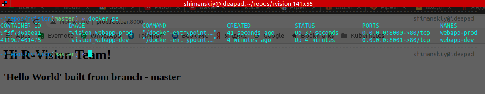
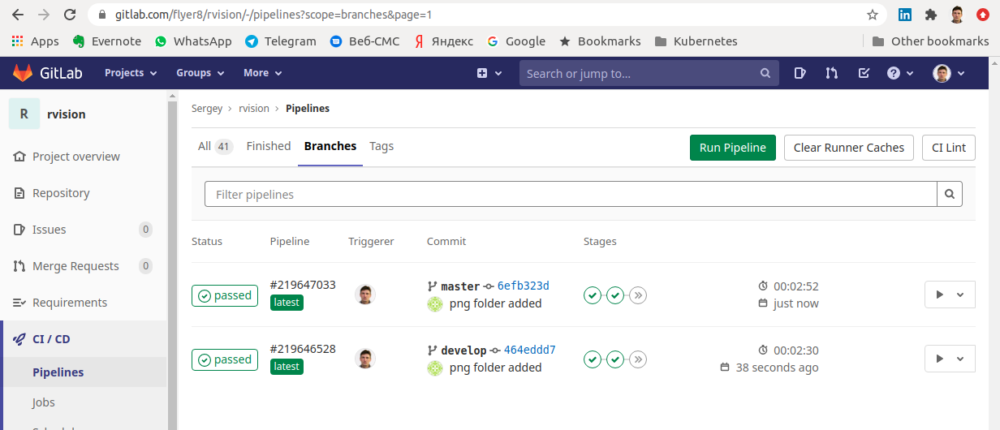
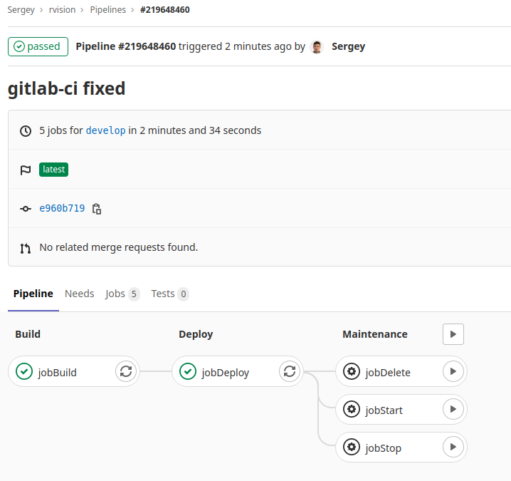

### Usage docker-compose with gitlab-ci pipeline for deploying web apps

Before deploying the test project, GitLab Runner was installed and registered on a remote Ubuntu 18.04 server according the official docs: https://docs.gitlab.com/runner/install/linux-manually.html

Checking via web interface:


Checking via docker on host:



Gitlab-CI GUI:




GitLab Runner config: `sudo cat /etc/gitlab-runner/config.toml`

```
concurrent = 1
check_interval = 0

[session_server]
  session_timeout = 1800

[[runners]]
  name = "ideapad"
  url = "https://gitlab.com/"
  token = "**********************"
  executor = "docker"
  [runners.custom_build_dir]
  [runners.cache]
    [runners.cache.s3]
    [runners.cache.gcs]
    [runners.cache.azure]
  [runners.docker]
    tls_verify = false
    image = "docker"
    privileged = true
    disable_entrypoint_overwrite = false
    oom_kill_disable = false
    disable_cache = false
    volumes = ["/var/run/docker.sock:/var/run/docker.sock", "/cache"]
    shm_size = 0
```
